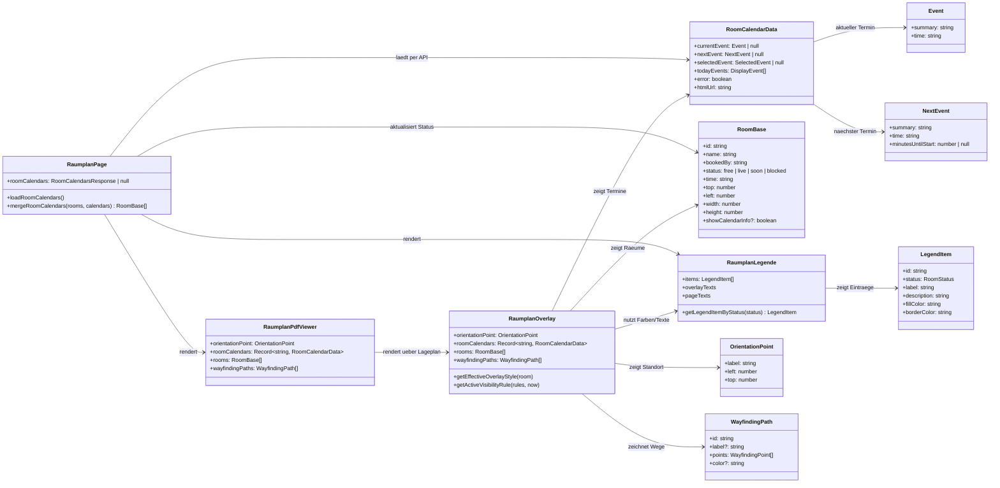
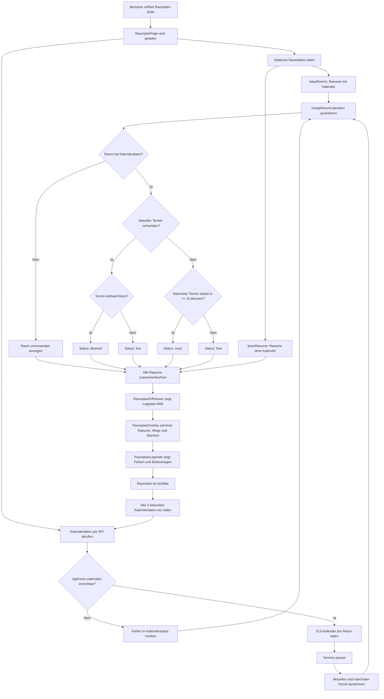

# Einfaches Klassendiagramm Raumplan

[Beschreibung der verwendeten Tools](./Toolbeschreibung.md)

[Klassendiagramm als PDF oeffnen](./klassendiagramm.pdf)

Kurz gesagt:

- `RaumplanPage` ist die Hauptseite. Sie holt Kalenderdaten von `/api/room-calendars`.
- `RoomBase` beschreibt einen Raum auf dem Lageplan, inklusive Position, Groesse und Status.
- `RoomCalendarData` beschreibt die Termine eines Raums.
- `mergeRoomCalendars` verbindet Raumdaten und Kalenderdaten.
- `RaumplanPdfViewer` zeigt den Lageplan als Bild.
- `RaumplanOverlay` legt Raeume, Wege und Standort ueber den Lageplan.
- `RaumplanLegende` liefert Farben, Texte und Status-Erklaerungen.

# Einfaches Flussdiagramm Raumplan

[Flussdiagramm als PDF oeffnen](./flussdiagramm.pdf)

Kurz gesagt:

- Die Seite laedt zuerst die statischen Raumpositionen.
- Danach ruft sie die Kalender-API ab.
- Aus den Kalenderdaten wird pro Raum ein Status berechnet: `free`, `live`, `soon` oder `blocked`.
- Am Ende werden alle Raeume ueber den Lageplan gelegt.
- Der Kalenderstatus wird automatisch alle 3 Sekunden aktualisiert.
